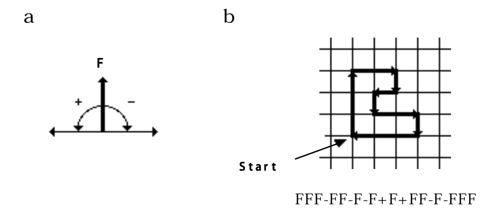
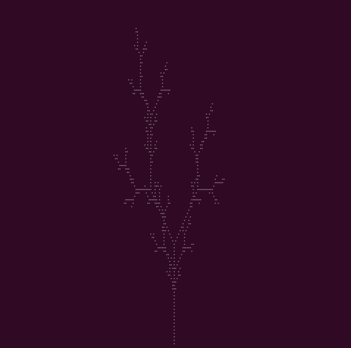
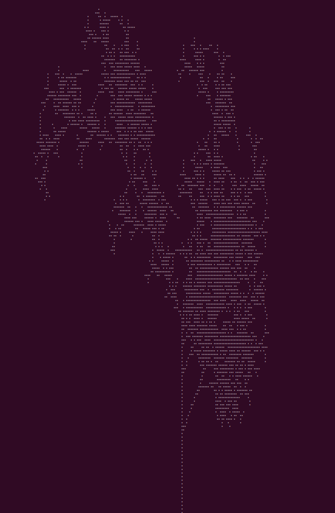
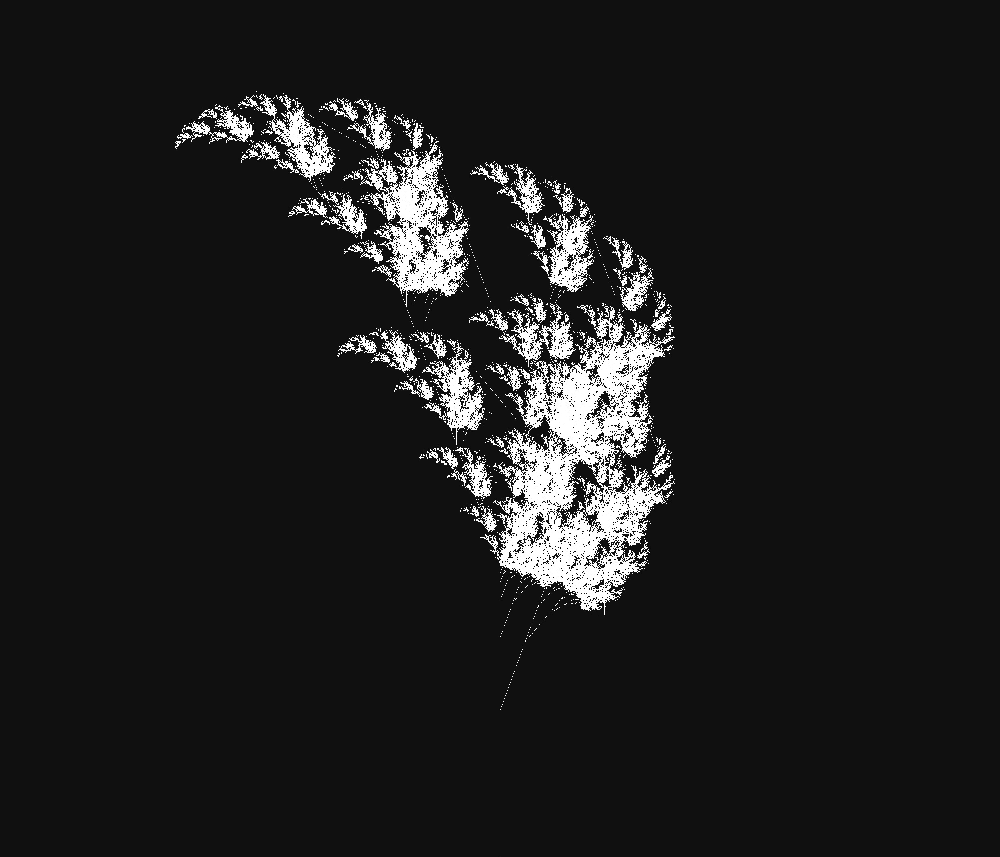
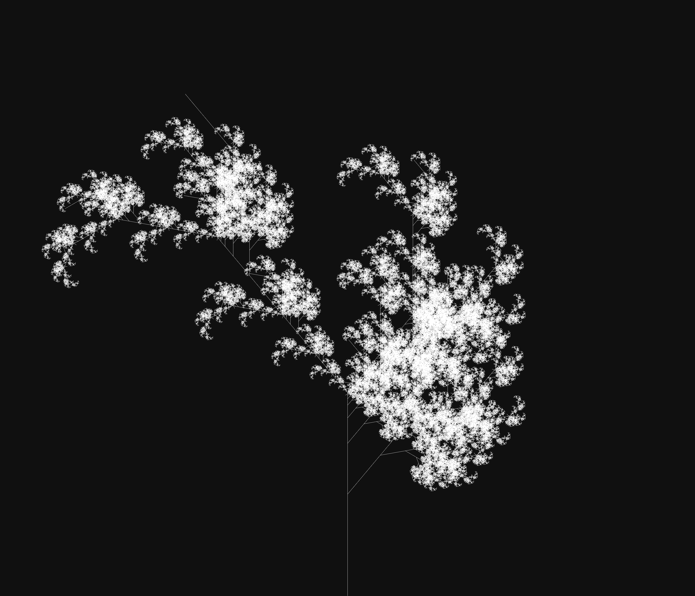
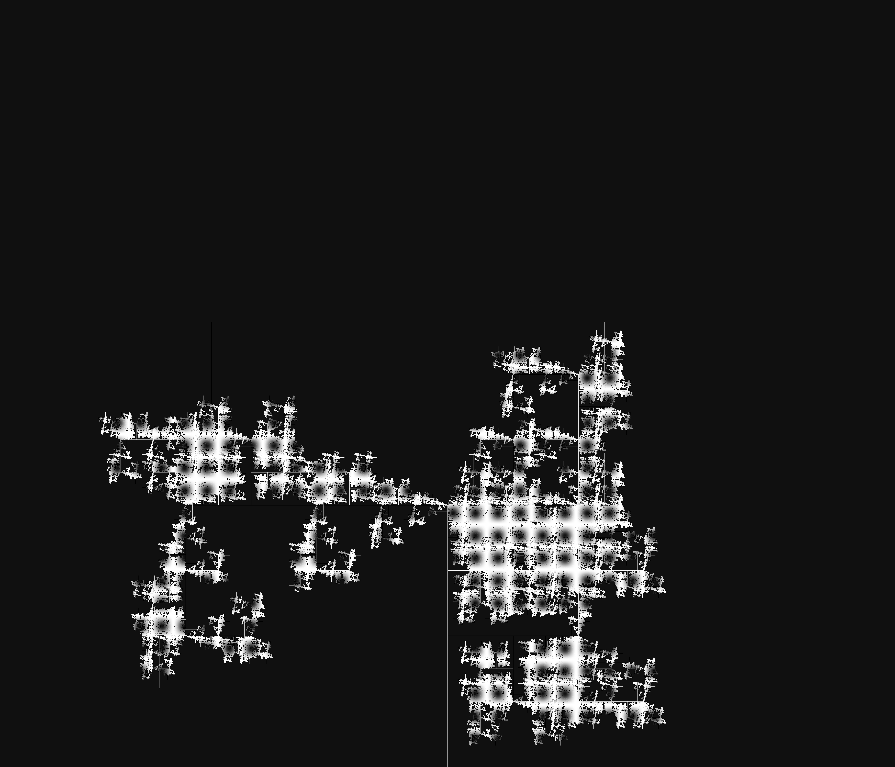
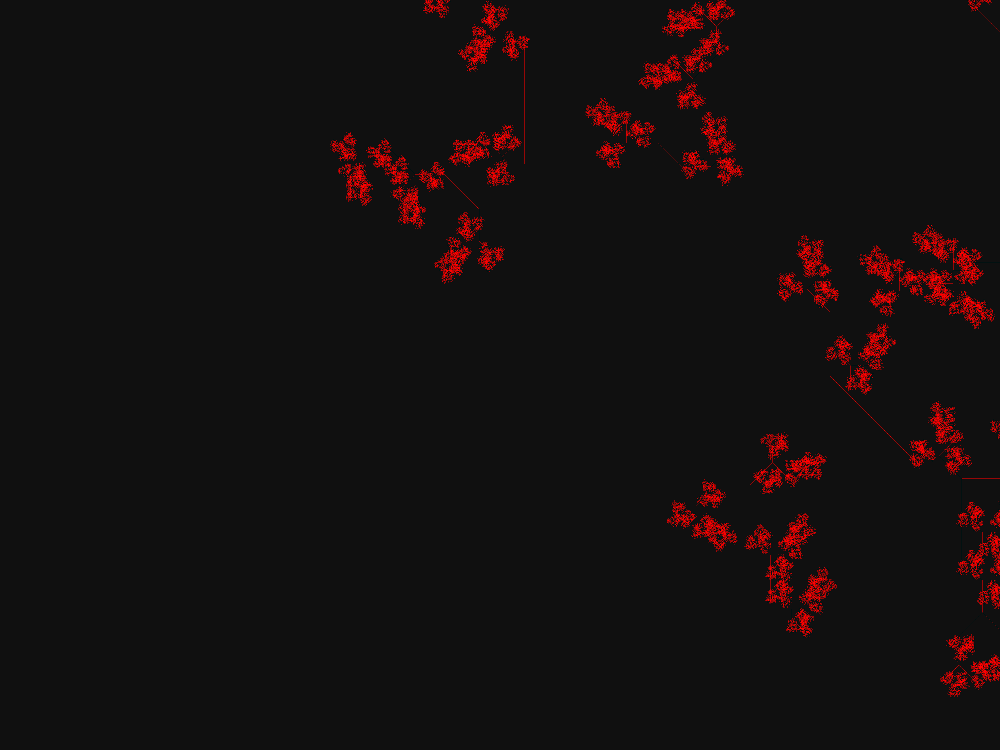
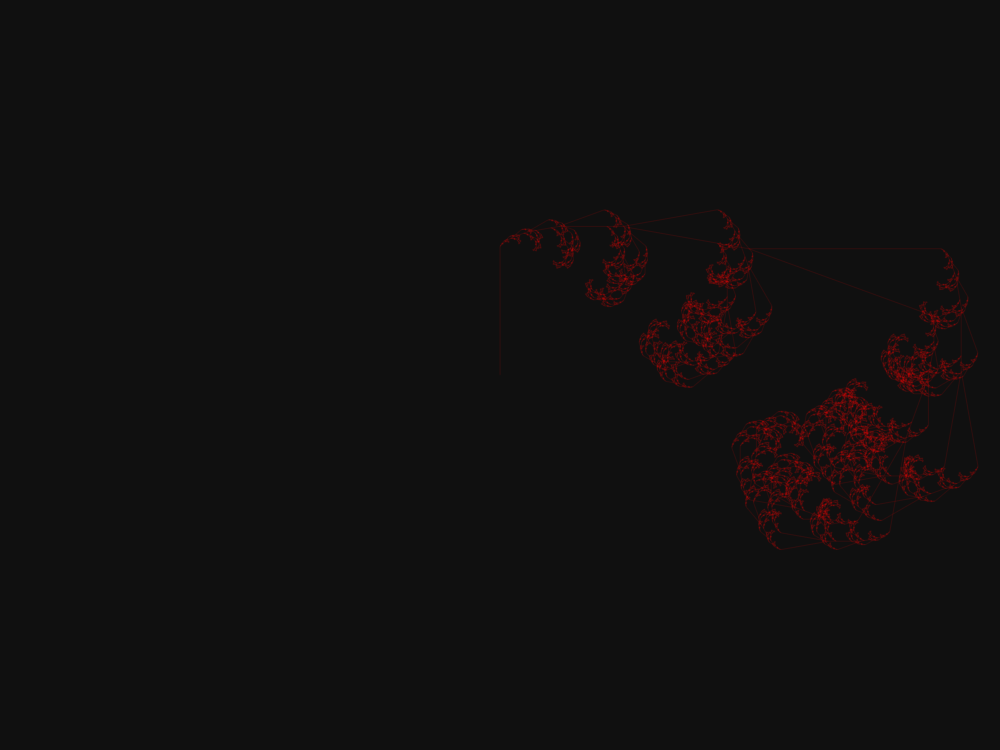
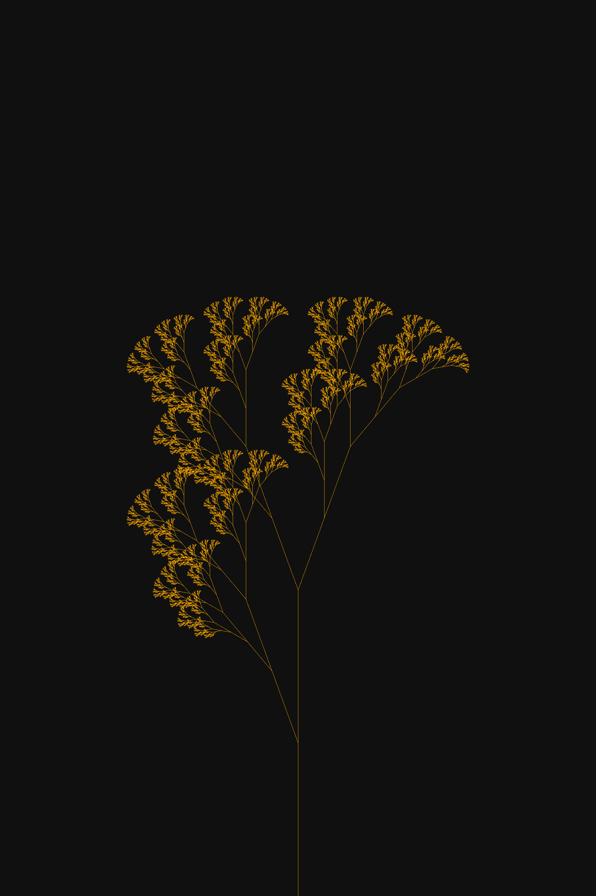
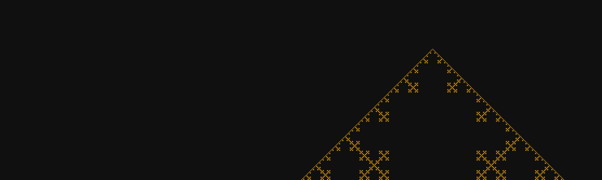

# ASCII L-system (Lindenmayer System)

L-System (Lindenmayer System) is a formal grammar introduced by Aristid Lindenmayer in 1968. It was initially developed to model the growth of plants and biological organisms, but later found applications in fractals, procedural graphics, and artificial intelligence.

## How Does the L-System Work?

Instead of describing it, let me show you:

`axiom = X`

`X -> FX`

`F -> FF`

The axiom is the starting point. So we begin with "X"

> X

It transforms into "FX", because "X" → "FX"

> FX

In the next iteration, we apply the rules to both "F" and "X"

> FFFX

It's going to the moon

> FFFFFFFX

etc.

Meaning:

- F – draw a line forward

- f – move forward without drawing (currently not suported)

- "+ / -" – turn right / left

- [ ] – branching (e.g., tree branches)

- A, B, C, X, Y ... – s ymbols used for rendering

`The Algorithmic Beauty of Plants
Book by Aristid Lindenmayer and Przemysław Prusinkiewicz, 2004, page 7`

If you're interested, I recommend this video https://www.youtube.com/watch?v=puwhf-404Xc

## Usage

The software is in an early stage of development, but you can already have fun with it. Just run the main.go file using the command `go run main.go`

You can generate both ASCII and images. For more commands and usage details, check [main.go](main.go) (especially flags)

## Examples ASCII

## Examples images

Angle is crucial in L-system, let me demonstrate:

--angle=20

> --axiom "X" --rules "X=F-[[X]+XF]+F[+FX[F]]-XK;F=FF" --iterations 10 --rows 3000 --cols=3500 --angle=20 --output="X=F-[[X]+XF]+F[+FX[F]]-XK;F=FFangle20.png"

--angle=40

> --axiom "X" --rules "X=F-[[X]+XF]+F[+FX[F]]-XK;F=FF" --iterations 10 --rows 3000 --cols=3500 --angle=40 --output="X=F-[[X]+XF]+F[+FX[F]]-XK;F=FFangle40.png"

--angle=90

> --axiom "X" --rules "X=F-[[X]+XF]+F[+FX[F]]-XK;F=FF" --iterations 10 --rows 3000 --cols=3500 --angle=90 --output="X=F-[[X]+XF]+F[+FX[F]]-XK;F=FFangle90.png"

> --axiom="X" --rules="X=FX-FF[+FFFX[-FFX]][-FFX];F=FF" --iterations=10 --rows=6000 --cols=8000 --angle=45 --output="X=FX-FF[+FFFX[-FFX]][-FFX];F=FF.png" --start="middle"

> --axiom "X" --rules "X=FXF[+FX[-FX]][-FX];F=FF" --iterations 10 --rows 8000 --cols=8000 --angle=45 --output="X=FXF[+FX[-FX]][-FX];F=FF.png" 

> --axiom "F" --rules "F=F[+F]F[-F]F" --iterations 9 --rows 20000 --cols=7000 --angle=25.7 --output="F=F[+F]F[-F]F.png"

> --axiom "X" --rules "X=FX-FF[+FFX][-FFX];F=FF" --iterations 10 --rows 6000 --cols=8000 --angle=10 --output="X=FX-FF[+FFX][-FFX];F=FF.png" --start="middle"

> --axiom "X" --rules "X=F[+X]F[-X]+X;F=FF" --iterations 10 --rows=3000 --cols=2000 --start="bottom" --angle=20 --output="X=F[+X]F[-X]+X;F=FF.png"

> --axiom "-F" --rules "F=F+F-F-F+F" --iterations 7 --rows=1500 --cols=5000 --start="bottom" --angle=90 --output="F+F-F-F+F.png" 

